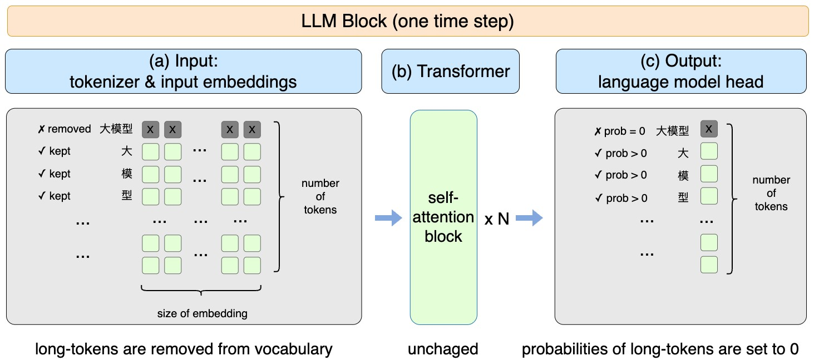
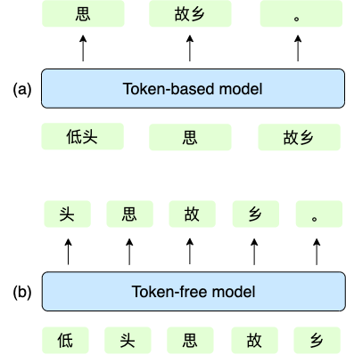
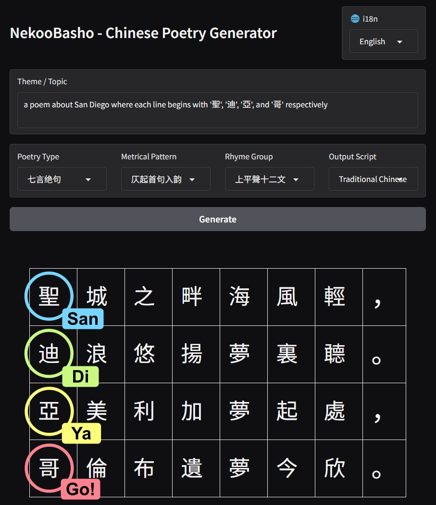

<style>
.hero-cover {
  color: #f1f5f9 !important;
  background: linear-gradient(135deg, #334155 0%, #475569 42%, #64748b 72%, #94a3b8 100%) !important;
}
</style>

<div class="flex justify-center my-4">
  
</div>

<p class="text-2xl">A Regulated Verse Generation Framework for LLMs</p>

<div class="mt-8 text-left text-sm opacity-80">

- Name origin: [**Qwen-Nekomata**](https://huggingface.co/collections/rinna/qwen-nekomata) + [**Matsuo Bashō**](https://en.wikipedia.org/wiki/Matsuo_Bash%C5%8D)
- Literal meaning of "NekooBasho": **Cat-Tail Banana**

</div>

---
layout: center
---

# Agenda

1. Problem Definition
2. Baseline: CharPoet
3. Our Method (and what we tried but did not work)
4. Evaluation
5. Conclusion

---
layout: two-cols
layoutClass: gap-4
---

# Problem Definition

## Regulated Verse

- Fixed number of lines
- Fixed number of Chinese characters per line
- Tone pattern constraints
- Rhyme-group constraints
- Antithesis
- Literary quality

::right::

<br><br>

<span style="color:#DAA520">白日</span><span style="color:#2E86AB">依</span><span style="color:#28A745">山</span><span style="color:#E07C24">尽</span>，  
The <span style="color:#DAA520">white sun</span> <span style="color:#E07C24">sets</span> <span style="color:#2E86AB">by</span> the <span style="color:#28A745">mountains</span>,  
<span style="color:#DAA520">黄河</span><span style="color:#2E86AB">入</span><span style="color:#28A745">海</span><span style="text-decoration:underline"><span style="color:#E07C24">流</span> \[lj<span style="color:#9B59B6">oʊ</span>˧˥\]</span>。  
The <span style="color:#DAA520">Yellow River</span> <span style="color:#E07C24">flows</span> <span style="color:#2E86AB">into</span> the <span style="color:#28A745">sea</span>.  
欲穷千里目，  
To see a thousand miles ahead,  
更上一层<span style="text-decoration:underline">楼\[l<span style="color:#9B59B6">oʊ</span>˧˥\]</span>。  
I must climb to the next level.  

---

# Problem Definition

## Why post-training is insufficient

- One token can contain **multiple Chinese characters**, which the model can not directly perceive.
- Tone and rhyme rules come from [Pingshui Rhymes](https://en.wikipedia.org/wiki/Pingshui_Yun) based on **Middle Chinese**, not modern Chinese pronunciation and not reflected through the writing system.
- These constraints are difficult to learn via generic post-training.
- Our later experiments support this: post-training does not reliably teach the model compliance to the formal restrictions of regulated verses.

---
layout: center
---

# Baseline

[**CharPoet**](https://aclanthology.org/2024.acl-demos.30.pdf): SOTA in prior work, accepted to ACL 2024, our main comparison target

<div class="flex justify-center my-4">
  
</div>

---
layout: two-cols
layoutClass: gap-4
---

# Our Method

## (1) Vocabulary Pruning

Following the approach in CharPoet

- Read the vocabulary of the LLM, and keep only tokens that are exactly one Chinese character.
- This guarantees every generated token corresponds to one Chinese character.

::right::

<br><br>

<div class="flex justify-center my-4">
  
</div>

---

# Our Method

## (2) Constrained Decoding

- Run a fixed number of decoding steps per line. Combined with vocabulary pruning, this guarantees exact character count per line.
- Query a Pingshui-rhyme knowledge base to build:
  - tone masks
  - rhyme-group masks
- At sampling time, characters violating metrical rules are assigned `-inf` score, so generated lines strictly satisfy tone/rhyme patterns.

---
layout: center
---

# What We Tried but Did Not Work

## Mask-Filling Fine-Tuning

We fine-tuned Qwen3-8B on [Complete Tang Poems](https://en.wikipedia.org/wiki/Complete_Tang_Poems) with a CharPoet-like mask-filling prompt template.

```python
masked_poem_dict = {
    "五言绝句":
    "<|extra_1|><|extra_1|><|extra_1|><|extra_1|><|extra_1|>，<|extra_1|><|extra_1|><|extra_1|><|extra_1|><|extra_1|>。...",
    ...
}
poetry_prompt_template_sc = '''<|im_start|>user
Please compose a {poem_type} on the theme: {user_prompt}.
Please fill in the following template, inserting one Chinese character at the position of each <|extra_1|>:
{masked_poem}<|im_end|>
<|im_start|>assistant
Here is a {poem_type} on the theme "{user_prompt}":
'''
```

---

# What We Tried but Did Not Work

<div class="relative">


<div class="relative z-10 w-2/3">

- The model was underfitted by training/validation loss.
- But it still lost general intelligence:
  - On topics uncommon to regulated verses, for example in modern scenarios, it ignores prompts and produced nonsense.
  - On common topics, it simply stacks poetic-looking tokens without coherent meaning.

</div>
</div>

---

# Evaluation Setup

- CharPoet did not release evaluation code, so we implemented it according to the paper description.
- Two prompting settings:
  - 100 idiom keywords
  - 100 natural-language instructions
- We evaluate both **metrical compliance** and **content quality**.

---
layout: two-cols
layoutClass: gap-4
---

# Metrical Evaluation

- We tried `PoemStructureChecker` from `pingshui-rhymes` library.
- Results were unexpectedly low.
- Found two major issues:
  - Incorrect handling of polyphonic Chinese characters
  - Incomplete character coverage
- We fixed these and open-sourced the corrected (better?) checker in our repo.

::right::

<div class="text-sm [&_p]:my-0.5 [&_table]:my-0.5">

<p class="font-bold mb-0.5 mt-0">Polyphonic Characters</p>

| Char | Pronun | Meaning |
|:---:|:---:|:---|
| 重 | zhòng | Heavy |
| 重 | chóng | Repetition |

<p class="font-bold mb-0.5 mt-1">Same Character in Multiple Forms</p>

| Forms | Explanation |
|:---:|:---|
| 为 | Simplified |
| 為 | Traditional, Taiwanese standard |
| 爲 | Traditional, classical standard |

</div>


---

# Metrical Evaluation Results

<style>
.metrical-table th,
.metrical-table td { padding-top: 0.6rem; padding-bottom: 0.6rem; }
</style>
<div class="mt-4 overflow-x-auto metrical-table">
<table class="w-full text-xs border-collapse">
  <thead>
    <tr class="bg-blue-50">
      <th class="border px-2 py-1" style="text-align: center">Metric</th>
      <th class="border px-2 py-1" style="text-align: center" colspan="2">Line Length ↑</th>
      <th class="border px-2 py-1" style="text-align: center" colspan="2">Rhyming ↑</th>
      <th class="border px-2 py-1" style="text-align: center" colspan="2">Ping-Ze Meter ↑</th>
      <th class="border px-2 py-1" style="text-align: center" colspan="2">Full Compliance ↑</th>
    </tr>
    <tr class="bg-blue-50">
      <th class="border px-2 py-1" style="text-align: center">Model</th>
      <th class="border px-2 py-1 text-center text-blue-700">NekooBasho</th>
      <th class="border px-2 py-1 text-center text-gray-500">CharPoet</th>
      <th class="border px-2 py-1 text-center text-blue-700">NekooBasho</th>
      <th class="border px-2 py-1 text-center text-gray-500">CharPoet</th>
      <th class="border px-2 py-1 text-center text-blue-700">NekooBasho</th>
      <th class="border px-2 py-1 text-center text-gray-500">CharPoet</th>
      <th class="border px-2 py-1 text-center text-blue-700">NekooBasho</th>
      <th class="border px-2 py-1 text-center text-gray-500">CharPoet</th>
    </tr>
  </thead>
  <tbody>
    <tr>
      <td class="border px-2 py-1 text-center">七言律诗</td>
      <td class="border px-2 py-1 text-center text-blue-700">100%</td>
      <td class="border px-2 py-1 text-center text-gray-500">98.5%</td>
      <td class="border px-2 py-1 text-center text-blue-700">95.0%</td>
      <td class="border px-2 py-1 text-center text-red-500">6.0%</td>
      <td class="border px-2 py-1 text-center text-blue-700">100%</td>
      <td class="border px-2 py-1 text-center text-red-500">9.5%</td>
      <td class="border px-2 py-1 text-center text-blue-700">95.0%</td>
      <td class="border px-2 py-1 text-center text-red-500">1.5%</td>
    </tr>
    <tr>
      <td class="border px-2 py-1 text-center">七言绝句</td>
      <td class="border px-2 py-1 text-center text-blue-700">100%</td>
      <td class="border px-2 py-1 text-center text-gray-500">98.5%</td>
      <td class="border px-2 py-1 text-center text-blue-700">100%</td>
      <td class="border px-2 py-1 text-center text-red-500">19.5%</td>
      <td class="border px-2 py-1 text-center text-blue-700">100%</td>
      <td class="border px-2 py-1 text-center text-red-500">29.0%</td>
      <td class="border px-2 py-1 text-center text-blue-700">100%</td>
      <td class="border px-2 py-1 text-center text-red-500">6.0%</td>
    </tr>
    <tr>
      <td class="border px-2 py-1 text-center">五言律诗</td>
      <td class="border px-2 py-1 text-center text-blue-700">100%</td>
      <td class="border px-2 py-1 text-center text-gray-500">100%</td>
      <td class="border px-2 py-1 text-center text-blue-700">95.0%</td>
      <td class="border px-2 py-1 text-center text-red-500">1.0%</td>
      <td class="border px-2 py-1 text-center text-blue-700">100%</td>
      <td class="border px-2 py-1 text-center text-red-500">3.5%</td>
      <td class="border px-2 py-1 text-center text-blue-700">95.0%</td>
      <td class="border px-2 py-1 text-center text-red-500">0.0%</td>
    </tr>
    <tr>
      <td class="border px-2 py-1 text-center">五言绝句</td>
      <td class="border px-2 py-1 text-center text-blue-700">100%</td>
      <td class="border px-2 py-1 text-center text-gray-500">99.5%</td>
      <td class="border px-2 py-1 text-center text-blue-700">100%</td>
      <td class="border px-2 py-1 text-center text-red-500">1.5%</td>
      <td class="border px-2 py-1 text-center text-blue-700">100%</td>
      <td class="border px-2 py-1 text-center text-red-500">26.0%</td>
      <td class="border px-2 py-1 text-center text-blue-700">100%</td>
      <td class="border px-2 py-1 text-center text-red-500">1.0%</td>
    </tr>
    <tr class="font-bold bg-gray-50">
      <td class="border px-2 py-1 text-center">Overall</td>
      <td class="border px-2 py-1 text-center text-blue-700">100%</td>
      <td class="border px-2 py-1 text-center text-gray-500">99.1%</td>
      <td class="border px-2 py-1 text-center text-blue-700">97.5%</td>
      <td class="border px-2 py-1 text-center text-red-500">7.0%</td>
      <td class="border px-2 py-1 text-center text-blue-700">100%</td>
      <td class="border px-2 py-1 text-center text-red-500">17.0%</td>
      <td class="border px-2 py-1 text-center text-blue-700">97.5%</td>
      <td class="border px-2 py-1 text-center text-red-500">2.1%</td>
    </tr>
  </tbody>
</table>
</div>

<div class="mt-4 text-sm opacity-80">
NekooBasho is nearly fully compliant to formal restrictions of regulated verses;<br>
CharPoet's claimed ~99% acc mostly reflects line length, not true tone/rhyme correctness.
</div>

---

# Content Evaluation

- We use LLM-as-a-Judge to avoid human bias, and use the same criteria as CharPoet: Fluency, Meaning, Coherence, Relevance, Aesthetics.
- In the paper of CharPoet, average scores are often above 4 (Scale 1-5) for almost all models and dimensions, making ranking uninformative.
- We adjusted judge prompts to be stricter:
  - avoid inflated scoring
  - assign low scores aggressively when weaknesses are clear
- This gives better separation among systems.

---

# Content Evaluation Results

Content Score (Scale 1-5) by Moonshot-v1-8k

<style>
.content-table th,
.content-table td { padding-top: 0.6rem; padding-bottom: 0.6rem; }
</style>
<div class="mt-4 overflow-x-auto content-table">
<table class="w-full text-xs border-collapse">
  <thead>
    <tr class="bg-blue-50">
      <th class="border px-2 py-1" style="text-align: center">Metric</th>
      <th class="border px-2 py-1" style="text-align: center" colspan="2">Fluency ↑</th>
      <th class="border px-2 py-1" style="text-align: center" colspan="2">Meaning ↑</th>
      <th class="border px-2 py-1" style="text-align: center" colspan="2">Coherence ↑</th>
      <th class="border px-2 py-1" style="text-align: center" colspan="2">Relevance ↑</th>
      <th class="border px-2 py-1" style="text-align: center" colspan="2">Aesthetics ↑</th>
    </tr>
    <tr class="bg-blue-50">
      <th class="border px-2 py-1" style="text-align: center">Model</th>
      <th class="border px-2 py-1 text-blue-700" style="text-align: center">NB</th>
      <th class="border px-2 py-1 text-gray-500" style="text-align: center">CP</th>
      <th class="border px-2 py-1 text-blue-700" style="text-align: center">NB</th>
      <th class="border px-2 py-1 text-gray-500" style="text-align: center">CP</th>
      <th class="border px-2 py-1 text-blue-700" style="text-align: center">NB</th>
      <th class="border px-2 py-1 text-gray-500" style="text-align: center">CP</th>
      <th class="border px-2 py-1 text-blue-700" style="text-align: center">NB</th>
      <th class="border px-2 py-1 text-gray-500" style="text-align: center">CP</th>
      <th class="border px-2 py-1 text-blue-700" style="text-align: center">NB</th>
      <th class="border px-2 py-1 text-gray-500" style="text-align: center">CP</th>
    </tr>
  </thead>
  <tbody>
    <tr>
      <td class="border px-2 py-1 text-center">Keyword</td>
      <td class="border px-2 py-1 text-center text-blue-700">4.40</td>
      <td class="border px-2 py-1 text-center text-gray-500">3.60</td>
      <td class="border px-2 py-1 text-center text-blue-700">4.46</td>
      <td class="border px-2 py-1 text-center text-gray-500">3.91</td>
      <td class="border px-2 py-1 text-center text-blue-700">4.54</td>
      <td class="border px-2 py-1 text-center text-gray-500">3.42</td>
      <td class="border px-2 py-1 text-center text-blue-700">4.96</td>
      <td class="border px-2 py-1 text-center text-gray-500">4.37</td>
      <td class="border px-2 py-1 text-center text-blue-700">4.37</td>
      <td class="border px-2 py-1 text-center text-gray-500">3.75</td>
    </tr>
    <tr>
      <td class="border px-2 py-1 text-center">Instruction</td>
      <td class="border px-2 py-1 text-center text-blue-700">3.77</td>
      <td class="border px-2 py-1 text-center text-gray-500">3.58</td>
      <td class="border px-2 py-1 text-center text-blue-700">3.89</td>
      <td class="border px-2 py-1 text-center text-gray-500">3.94</td>
      <td class="border px-2 py-1 text-center text-blue-700">3.86</td>
      <td class="border px-2 py-1 text-center text-gray-500">3.53</td>
      <td class="border px-2 py-1 text-center text-blue-700">4.26</td>
      <td class="border px-2 py-1 text-center text-gray-500">4.25</td>
      <td class="border px-2 py-1 text-center text-blue-700">3.74</td>
      <td class="border px-2 py-1 text-center text-gray-500">3.63</td>
    </tr>
    <tr class="font-bold bg-gray-50">
      <td class="border px-2 py-1 text-center">Overall</td>
      <td class="border px-2 py-1 text-center text-blue-700">4.09</td>
      <td class="border px-2 py-1 text-center text-gray-500">3.59</td>
      <td class="border px-2 py-1 text-center text-blue-700">4.18</td>
      <td class="border px-2 py-1 text-center text-gray-500">3.93</td>
      <td class="border px-2 py-1 text-center text-blue-700">4.20</td>
      <td class="border px-2 py-1 text-center text-gray-500">3.48</td>
      <td class="border px-2 py-1 text-center text-blue-700">4.61</td>
      <td class="border px-2 py-1 text-center text-gray-500">4.31</td>
      <td class="border px-2 py-1 text-center text-blue-700">4.06</td>
      <td class="border px-2 py-1 text-center text-gray-500">3.69</td>
    </tr>
  </tbody>
</table>
</div>

<div class="mt-4 text-sm opacity-80">
NekooBasho significantly outperforms CharPoet in almost all dimensions across all prompting schemes.
</div>

---

# Conclusion

- We build a poetry generation framework that relies on **inference-time control**.
- Our approach requires no post-training, and can migrate to stronger future LLMs with minimal cost.
- For this task, expensive post-training can underperform well-designed decoding constraints.
- We also open-source missing/fixed benchmark tools for evaluating regulated verse generation.

---
layout: two-cols
layoutClass: gap-4
---

<div class="absolute top-8 left-0 right-0 text-center">
  <h1>Teaser</h1>
</div>

<div class="flex items-center justify-center mt-12">
  
</div>

::right::

<br><br>

- Sea breezes are light by the Holy City,
- Listening to the melody of Diego's waves in dreams.
- The place where the American dream originated,
- Where Columbus's long-held dream finds joy today.

---
layout: center
class: text-center
---

# Thank You

<div class="flex justify-center my-4">
  
</div>
